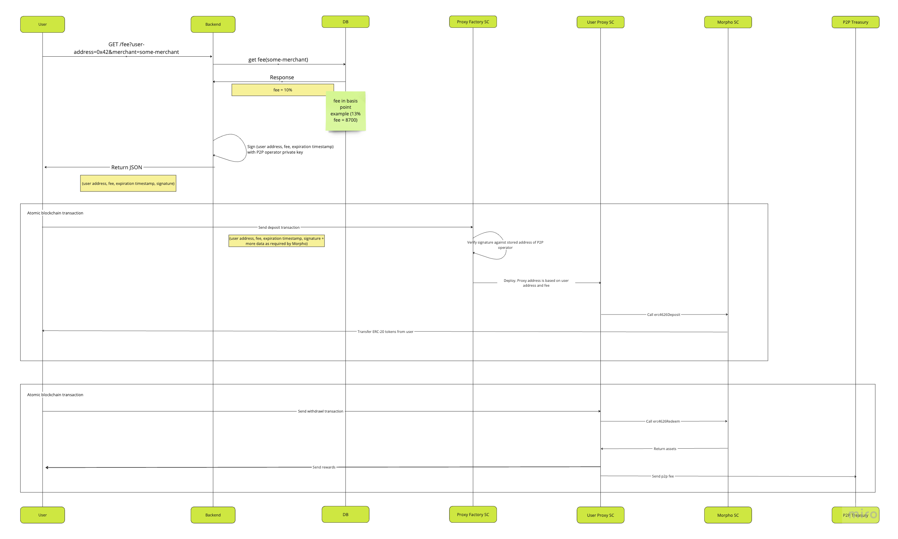

## p2p-lending-proxy

Contracts for depositing and withdrawing ERC-20 tokens from lending protocols.

## Running tests

```shell
curl -L https://foundry.paradigm.xyz | bash
source /Users/$USER/.bashrc
foundryup
forge test
```

## Deployment

```shell
forge script script/Deploy.s.sol:Deploy --rpc-url $RPC_URL --private-key $PRIVATE_KEY --broadcast --chain $CHAIN_ID --json --verify --etherscan-api-key $ETHERSCAN_API_KEY -vvvvv
```

This script will:

- deploy and verify on Etherscan the **P2pLendingProxyFactory** and **P2pLendingProxy** contracts
- set the **P2pTreasury** address permanently in the P2pLendingProxyFactory
- set the rules for Morpho specific deposit and withdrawal functions

## Basic use case



#### Morpho Deposit flow

Look at [function _doDeposit()](test/MainnetIntegration.sol#L1212) for a reference implementation of the flow.

1. Website User (called Client in contracts) calls Backend with its (User's) Ethereum address and some Merchant info.

2. Backend uses Merchant info to determine the P2P fee (expressed as client basis points in the contracts).

3. Backend calls P2pLendingProxyFactory's `getHashForP2pSigner` function to get the hash for the P2pSigner.

```solidity
    /// @dev Gets the hash for the P2pSigner
    /// @param _client The address of client
    /// @param _clientBasisPoints The client basis points
    /// @param _p2pSignerSigDeadline The P2pSigner signature deadline
    /// @return The hash for the P2pSigner
    function getHashForP2pSigner(
        address _client,
        uint96 _clientBasisPoints,
        uint256 _p2pSignerSigDeadline
    ) external view returns (bytes32);
```

4. Backend signs the hash with the P2pSigner's private key using `eth_sign`. Signing is necessary to authenticate the client basis points in the contracts.

5. Backend returns JSON to the User with (client address, client basis points, signature deadline, and the signature).

6. Client-side JS code prepares all the necessary data for the Morpho deposit function. Since the deposited tokens will first go from the client to the client's P2pLendingProxy instance and then from the P2pLendingProxy instance into the Morpho protocol, both of these transfers are approved by the client via Permit2. The client's P2pLendingProxy instance address is fetched from the P2pLendingProxyFactory contract's `predictP2pLendingProxyAddress` function:

```solidity
    /// @dev Computes the address of a P2pLendingProxy created by `_createP2pLendingProxy` function
    /// @dev P2pLendingProxy instances are guaranteed to have the same address if _feeDistributorInstance is the same
    /// @param _client The address of client
    /// @return address The address of the P2pLendingProxy instance
    function predictP2pLendingProxyAddress(
        address _client,
        uint96 _clientBasisPoints
    ) external view returns (address);
```

7. Client-side JS code checks if User has already approved the required amount of the deposited token for Permit2. If not, it prompts the User to call the `approve` function of the deposited token contract with the uint256 MAX value and Permit2 contract as the spender.

8. Client-side JS code prompts the User to do `eth_signTypedData_v4` twice:

- first time to sign `PermitSingle` from the P2pLendingProxy instance into the Morpho protocol
- second time to sign `PermitSingle` from the User's wallet into the P2pLendingProxy instance

9. Client-side JS code prompts the User to call the `deposit` function of the P2pLendingProxyFactory contract:

```solidity
    /// @dev Deposits the lending protocol
    /// @param _lendingProtocolAddress The lending protocol address
    /// @param _lendingProtocolCalldata The lending protocol calldata
    /// @param _permitSingleForP2pLendingProxy The permit single for P2pLendingProxy
    /// @param _permit2SignatureForP2pLendingProxy The permit2 signature for P2pLendingProxy
    /// @param _clientBasisPoints The client basis points
    /// @param _p2pSignerSigDeadline The P2pSigner signature deadline
    /// @param _p2pSignerSignature The P2pSigner signature
    /// @return p2pLendingProxyAddress The client's P2pLendingProxy instance address
    function deposit(
        address _lendingProtocolAddress,
        bytes calldata _lendingProtocolCalldata,
        IAllowanceTransfer.PermitSingle memory _permitSingleForP2pLendingProxy,
        bytes calldata _permit2SignatureForP2pLendingProxy,

        uint96 _clientBasisPoints,
        uint256 _p2pSignerSigDeadline,
        bytes calldata _p2pSignerSignature
    )
    external
    returns (address p2pLendingProxyAddress);
```

#### Morpho Withdrawal flow

Look at [function _doWithdraw()](test/MainnetIntegration.sol#L1260) for a reference implementation of the flow.

1. Client-side JS code prepares all the necessary data for the Morpho redeem function.

2. Client-side JS code prompts the User to call the `withdraw` function of the client's instance of the P2pLendingProxy contract:

```solidity
    /// @notice Withdraws assets from the lending protocol
    /// @param _lendingProtocolAddress The address of the lending protocol
    /// @param _lendingProtocolCalldata The calldata to call the lending protocol
    /// @param _vault The vault address
    /// @param _shares The shares to withdraw
    function withdraw(
        address _lendingProtocolAddress,
        bytes calldata _lendingProtocolCalldata,
        address _vault,
        uint256 _shares
    )
    external;
```

The P2pLendingProxy contract will redeem the tokens from Morpho and send them to User. The amount on top of the deposited amount is split between the User and the P2pTreasury according to the client basis points.

## Claiming from Morpho Universal Rewards Distributors

This is Morpho specific. This feature is not available in other lending protocols.

Look at [function test_MorphoClaimingByClient_Mainnet()](test/MainnetMorphoClaiming.sol#L84) for a reference implementation of the flow.

1. Client-side JS code prepares all the necessary data for the Morpho `urdClaim` function according to the [Morpho docs](https://docs.morpho.org/rewards/tutorials/claim-rewards/).

2. Client-side JS code prompts the User to call the `morphoUrdClaim` function of the client's instance of the P2pLendingProxy contract:

```solidity
    /// @notice Claims Morpho Urd rewards
    /// @dev This function is Morpho specific. Cannot be reused for other protocols.
    /// @param _distributor The distributor address
    /// @param _reward The reward address
    /// @param _amount The amount to claim
    /// @param _proof The proof for the claim
    function morphoUrdClaim(
        address _distributor,
        address _reward,
        uint256 _amount,
        bytes32[] calldata _proof
    )
    external;
```

The P2pLendingProxy contract will get the reward tokens from Morpho and split them between the User and the P2pTreasury according to the client basis points.

## Calling any function on any contracts via P2pLendingProxy

It's possible for the User to call any function on any contracts via P2pLendingProxy. This can be useful if it appears that functions of lending protocols beyond simple deposit and withdrawal are needed. Also, it can be useful for claiming any airdrops unknown in advance.

Before the User can use this feature, the P2P operator needs to set the rules for the function call via the `setCalldataRules` function of the P2pLendingProxyFactory contract:

```solidity
    /// @dev Sets the calldata rules
    /// @param _functionType The function type
    /// @param _contract The contract address
    /// @param _selector The selector
    /// @param _rules The rules
    function setCalldataRules(
        P2pStructs.FunctionType _functionType,
        address _contract,
        bytes4 _selector,
        P2pStructs.Rule[] calldata _rules
    ) external;
```

The rules should be as strict as possible to prevent any undesired function calls.

Once the rules are set, the User can call the permitted function on the permitted contract with the permitted calldata via P2pLendingProxy's `callAnyFunction` function:

```solidity
    /// @notice Calls an arbitrary allowed function
    /// @param _lendingProtocolAddress The address of the lending protocol
    /// @param _lendingProtocolCalldata The calldata to call the lending protocol
    function callAnyFunction(
        address _lendingProtocolAddress,
        bytes calldata _lendingProtocolCalldata
    )
    external;
```
